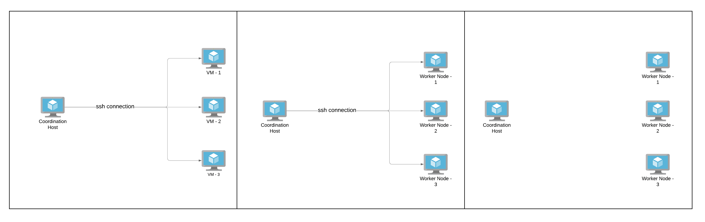

# Worker Node Deployment

## **Overview**

### _Worker Node_

**Worker Node** is the host where workers live. You need to deploy at least one worker node for Arrebol.

### _Coordination Host_

The **coordination host** is basically a machine from which scripts are executed to deploy worker nodes. The coordination host must have access to worker nodes via **SSH (using a rsa key pair)** to perform its function.



## **Infrastructure**

### _Worker Node_

  #### Requirements

  The requirements of the Worker Node depend a lot on the workload of the Jobs you intend to submit to Arrebol. Below is a minimum standard recommendation:

  - vCPU: 2
  - RAM: 2GB
  - FREE DISK SPACE: 10GB
  - OS: Ubuntu 16 or higher

  #### Security Group

  * Custom TCP Rule to allow ingress in the port 5555 (Docker API)
  * Custom TCP Rule to allow ingress in the port 22 (SSH)
  --- 

### _Coordination Host_

  #### Requirements 
  - vCPU: 1
  - RAM: 1GB
  - FREE DISK SPACE: 10GB
  - OS: Ubuntu 16 or higher

## **Setup**

### _1.Create RSA Key Pair_

`Note: If you already have a key pair configured between the coordination host and the worker nodes go to Install dependencies.`

Log into the coordination host, and then use command-line SSH to generate a key pair using the RSA algorithm.
To generate RSA keys, on the command line, enter:

```bash
mkdir -p ~/.ssh
cd ~/.ssh
ssh-keygen -t rsa -N "" -f coordination_host_key
chmod 600 coordination_host_key
```
The coordination host private key will be generated using the filename 
**coordination_host_key** and the public key using the filename **coordination_host_key.pub**. It was stored in a **.ssh** directory off home directory.

Now you need to authorize the coordination host to access the worker node via SSH.

First you need have the **coordination_host_key.pub** in the worker node. After, log into the worker node machine and write the **coordination_host_key.pub** into **authorized keys** using the commands below:
```bash
mkdir -p ~/.ssh
touch ~/.ssh/authorized_keys
cat ~/coordination_host_key.pub >> ~/.ssh/authorized_keys
```


### _2.Install dependencies_

Log in the coordination host and run the following commands to install dependencies.

```
sudo apt update
sudo apt install software-properties-common
sudo apt-add-repository --yes --update ppa:ansible/ansible
sudo apt install -y ansible git grep sed 
```

### _3.Download the repository_

Log in the coordination host and run the below commands to download the arrebol repository.

```bash
git clone -b feature/remote-worker https://github.com/ufcg-lsd/arrebol.git
```

### _4.Fill configuration file_

Go to the directory _worker/deploy_ inside _arrebol_ directory.

```bash
cd arrebol/worker/deploy
```

Then, edit the `hosts.conf` file present in this directory, as instructed in the following.\
 **All fields** of the files must be filled. See below how to edit it. 

#### Hosts configuration
```
# Required
# For each worker node write a field started by `worker_ip`

worker_ip_1=
worker_ip_2=
worker_ip_n=

# Required
remote_user=

# Required
ansible_ssh_private_key_file=
```

| Field                             | Description    |
|:---------------------------------:|----------------|
| **worker_ip**                         | The **worker node** addresses. For each ip create a field beginning with **_worker_ip_**. |
| **remote_user**                       | The user name that should be used to access the **worker nodes** via ssh.  |
| **ansible_ssh_private_key_file**      | The path to the **coordination host private key** that will be used to access worker nodes via ssh       |

### _5.Install_

After configuring the `hosts.conf` file, execute the `install.sh` script in the coordination host to setup the Worker Node.

  ```
  sudo bash install.sh
  ```

## **Check**


To verify whether the worker deployment was successful, one can submit below sample requests to the docker api.

`Note 1: By default, the deployment opens port 5555 for the docker api.`

`Note 2: If you use a cloud provider you may need to add a firewall rule.`

---
### Request
```bash
curl http://<worker-address>:5555/version
```

### Expected
```json
{
  "Platform": {
    "Name": "Docker Engine - Community"
  },
  "Components": [
    {
      "Name": "Engine",
      "Version": "19.03.7",
      "Details": {
        "ApiVersion": "1.40",
        "Arch": "amd64",
        "BuildTime": "2020-03-04T01:21:08.000000000+00:00",
        "Experimental": "false",
        "GitCommit": "7141c199a2",
        "GoVersion": "go1.12.17",
        "KernelVersion": "4.15.0-88-generic",
        "MinAPIVersion": "1.12",
        "Os": "linux"
      }
    },
    {
      "Name": "containerd",
      "Version": "1.2.13",
      "Details": {
        "GitCommit": "7ad184331fa3e55e52b890ea95e65ba581ae3429"
      }
    },
    {
      "Name": "runc",
      "Version": "1.0.0-rc10",
      "Details": {
        "GitCommit": "dc9208a3303feef5b3839f4323d9beb36df0a9dd"
      }
    },
    {
      "Name": "docker-init",
      "Version": "0.18.0",
      "Details": {
        "GitCommit": "fec3683"
      }
    }
  ],
  "Version": "19.03.7",
  "ApiVersion": "1.40",
  "MinAPIVersion": "1.12",
  "GitCommit": "7141c199a2",
  "GoVersion": "go1.12.17",
  "Os": "linux",
  "Arch": "amd64",
  "KernelVersion": "4.15.0-88-generic",
  "BuildTime": "2020-03-04T01:21:08.000000000+00:00"
}
```
